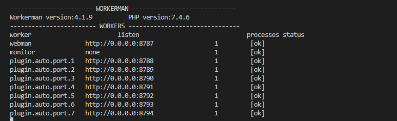
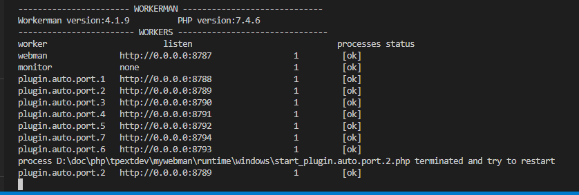

## 简介

自动创建多个`process`对应多个端口，可使用`apache`或`nginx`等做负载均衡。

`windows`下webman不支持多进程，使用此插件增加并发能力。

`linux`系统也可以用使用，如果你使用了`nginx`作为代理，那顺便使用`nginx`做一下负载均衡。

## 安装

`composer require ichynul/auto-process`

## 使用

在配置文件`config/server.php`中调整默认端口进程数量`count`数量为`1`。(`windows`可忽略此步，`linux`必调，否则默认端口开启多进程，负载均衡配置要适当考量多一些权重。)

在配置文件`config/plugin/auto/port.app.php`中调整`process_count`数量。

例如`8`，那将会自动创建`7`不同的端口.

### nginx 代理设置
和官方配置一样：
https://www.workerman.net/doc/webman/others/nginx-proxy.html
在`upstream webman`添加多个server-port
```
upstream webman {
    server 127.0.0.1:8787;
	server 127.0.0.1:8788;
	server 127.0.0.1:8789;
	server 127.0.0.1:8790;
	server 127.0.0.1:8791;
	server 127.0.0.1:8792;
	server 127.0.0.1:8793;
	server 127.0.0.1:8794;
	#...更多
    keepalive 10240;
}
server {
	#...
}
```
### Windows上使用nssm生成网站服务，开机自启，崩溃自启
https://www.workerman.net/a/1422

#### Windows集成环境推荐
[upupw+kangle](https://php.upupw.net/ank2downloads/38/6698.html)

## 效果图(可选)
启动后：

任务管理器显示：

杀死进程模拟程序异常终止：


## LICENSE
MIT